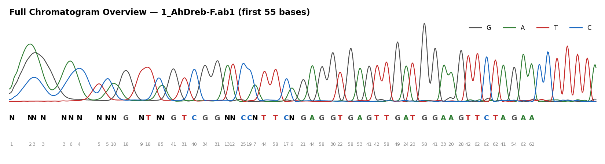
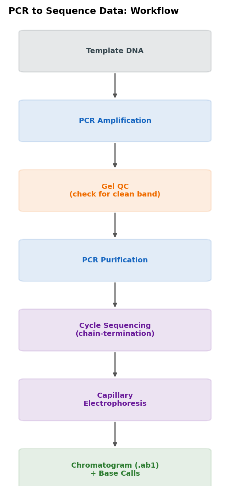
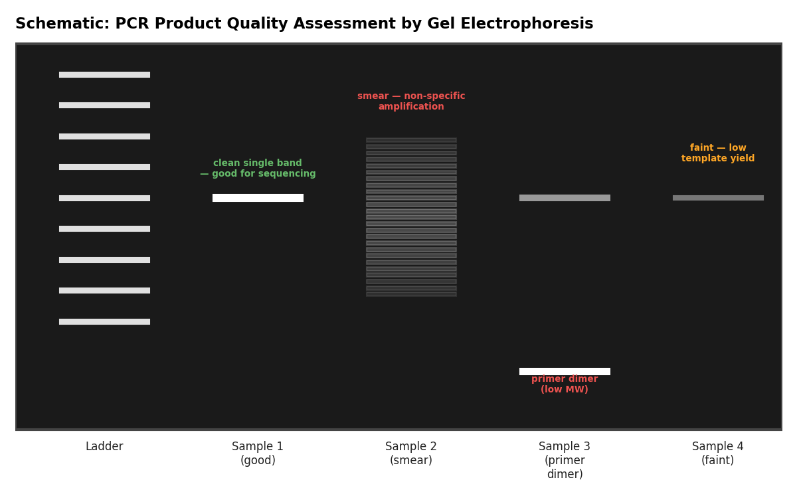
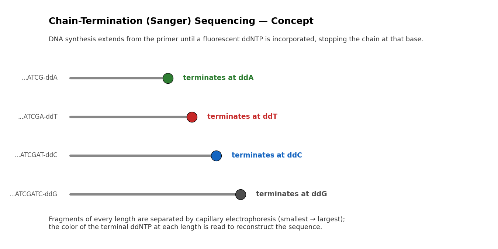
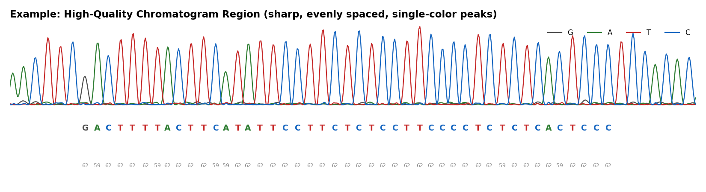
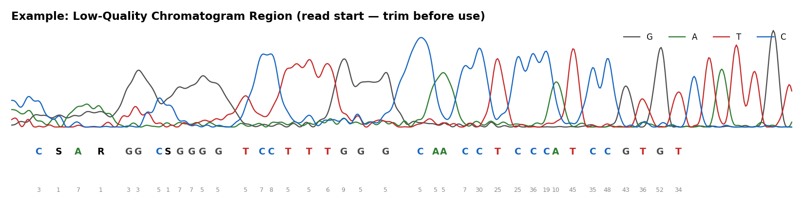

<p align="center">
  
  &nbsp;&nbsp;&nbsp;
  
</p>

<p align="center"><sub>
</sub></p>

---

# Sanger Sequencing Data Analysis - Hands-On Training

A hands-on training module covering the full path from PCR product to verified gene identity: the biology behind Sanger sequencing, how to read the QC reports that sequencing vendors send back, and practical chromatogram analysis using real `.ab1` files as test data - using **BioEdit**, **NCBI BLASTn**, **MEGA**, and **iTOL** only. No programming required.


<sub>Real chromatogram trace from this repository's own test data (<code>1_AhDreb-F.ab1</code>), showing the typical transition from low-confidence base calls (N's, low Phred scores) at the read start to sharp, high-confidence peaks further into the read.</sub>

> **No prior sequencing experience needed.** This training assumes only that you know DNA is made of four bases (A, C, G, T) and that PCR copies a specific piece of DNA. Every technical term below is explained in plain language before it's used formally.

---

## Day 2 Training Programme

| Session | Duration | Topic |
|---|---|---|
| **1. From PCR to Sequence Data** | 30 min | PCR → sequencing workflow, PCR QC/purification, overview of sequencing output files |
| **2. Principles of Sanger Sequencing** | 1.5 hrs | Chain-termination chemistry, dye terminators, capillary electrophoresis, base calling, F/R reads, quality factors |
| **3. Hands-on Sequence Analysis & Guided Practice** | 2 hrs | Instructor demo + guided participant exercise: open chromatograms, assess quality, trim, build consensus, BLAST; alignment/tree building as optional extension |

Full session-by-session facilitator guides live in [`docs/`](docs/):

- [`docs/session1_pcr_to_sequence_data.md`](docs/session1_pcr_to_sequence_data.md)
- [`docs/session2_principles_of_sanger_sequencing.md`](docs/session2_principles_of_sanger_sequencing.md)
- [`docs/session3_hands_on_practice.md`](docs/session3_hands_on_practice.md)

This README is the standalone overview - everything below can also be taught directly from this page.

---

# Table of Contents

- [Learning Objectives](#learning-objectives)
- [Prerequisites & Required Software](#prerequisites--required-software)
- [A Quick Primer, Before We Start](#a-quick-primer-before-we-start)
- [Repository Structure](#repository-structure)
- [Test Data](#test-data)
- [Session 1 – From PCR to Sequence Data](#session-1--from-pcr-to-sequence-data)
- [Session 2 – Principles of Sanger Sequencing](#session-2--principles-of-sanger-sequencing)
- [Session 3 – Hands-On Sequence Analysis](#session-3--hands-on-sequence-analysis)
  - [3a. Chromatogram Quality Assessment](#3a-chromatogram-quality-assessment)
  - [3b. Instructor-Led Demo: BioEdit Trimming & Consensus](#3b-instructor-led-demo-bioedit-trimming--consensus)
  - [3c. Confirming Identity with BLASTn](#3c-confirming-identity-with-blastn)
  - [3d. Alignment & Variant Detection in MEGA](#3d-alignment--variant-detection-in-mega)
  - [3e. Tree Visualization with iTOL](#3e-tree-visualization-with-itol)
  - [3f. Common Artefacts & Troubleshooting](#3f-common-artefacts--troubleshooting)
  - [Guided Participant Exercise](#guided-participant-exercise)
- [Final Report Template](#final-report-template)
- [Best Practices](#best-practices)
- [Acknowledgements / Attribution](#acknowledgements--attribution)
- [License](#license)

---

# Learning Objectives

Upon completion of this training, participants will be able to:

- Describe the workflow from PCR amplification to Sanger sequencing.
- Explain the chemistry of chain-termination (dideoxy) sequencing.
- Interpret a chromatogram, including peak shape, spacing, background noise, and mixed peaks.
- Evaluate sequence quality using Phred quality scores and vendor trimming reports.
- Open, trim, and edit `.ab1` chromatograms in BioEdit.
- Assemble forward and reverse reads into a single consensus sequence.
- Confirm gene identity using BLASTn.
- Align sequences and detect variants using MEGA.
- Build and visualize a simple phylogenetic tree using MEGA and iTOL.
- Recognize common sequencing artefacts and apply appropriate troubleshooting.

---

# Prerequisites & Required Software

Participants are expected to have basic molecular biology knowledge (PCR, primers, gel electrophoresis) and basic familiarity with DNA structure. No programming or command-line experience is required - every tool used in this training is graphical.

| Software | Purpose | Platform |
|-----------|----------|----------|
| BioEdit | Chromatogram viewing, trimming, contig assembly, editing | Windows |
| NCBI BLASTn (web) | Sequence identity confirmation | Web browser |
| MEGA | Multiple sequence alignment, variant inspection, tree building | Windows/Mac/Linux |
| iTOL (web) | Phylogenetic tree visualization and annotation | Web browser |

---

# A Quick Primer, Before We Start

If terms like "chromatogram," "base calling," or "Phred score" are new to you, read this short section first - it explains the big picture in plain language before the technical sessions dive into detail.

**What are we actually doing?**
Sequencing means reading out, letter by letter, the exact order of A's, C's, G's, and T's in a piece of DNA. PCR gives us many copies of one specific stretch of DNA; sequencing tells us what that stretch actually says.

**What is a chromatogram?**
Think of it as the "raw photograph" of a sequencing result - a series of colored peaks, one per base, each color representing one of the four DNA letters (A, C, G, or T). The sequencing machine doesn't hand you clean text; it hands you this peak trace, and reading the peaks correctly is the core skill of this training.

**Why would a peak ever be wrong or unclear?**
Just like a photo can be blurry at the edges or in poor light, chromatogram peaks can be sharp and confident in the middle of a read and blurry/overlapping near the start or end. Part of this training is learning to tell the difference and trust only the good peaks.

**Why forward AND reverse reads?**
Each read only reliably covers part of the DNA fragment well (the very beginning and end of any read tend to be weaker - more on why in Session 2). Sequencing the same fragment from both directions is like proofreading a document twice, from both ends, so weak spots in one read are covered by strong data in the other.

**What does BLASTn do?**
Once you have a trusted sequence, BLASTn compares it against a huge public database of known sequences and tells you what it matches - this is how you confirm "yes, this is the gene I intended to amplify," not something else.

With that picture in mind, Sessions 1–3 build up the full detail behind each step.

---

# Repository Structure

```text
sanger-sequencing-training/
├── README.md                     ← you are here
├── docs/                         ← session-by-session facilitator guides
│   ├── session1_pcr_to_sequence_data.md
│   ├── session2_principles_of_sanger_sequencing.md
│   └── session3_hands_on_practice.md
├── data/
│   ├── raw_ab1/                  ← 14 real .ab1 chromatogram files (test data)
│   └── seq_info/                 ← vendor QC summary reports (metadata worked example)
└── assets/
    └── images/                   ← figures and organizational logos used in this README
```

> This training uses **no scripts and no programming**. Everything is done through BioEdit, a web browser (BLASTn, iTOL), and MEGA - all point-and-click.

---

# Test Data

`data/raw_ab1/` contains 14 real chromatogram files used as training material, sequenced on an ABI 3730 capillary sequencer, in forward/reverse pairs:

```
1A-F.ab1 / 1A-R.ab1          2A-F.ab1 / 2A-R.ab1
3B-F.ab1 / 3B-R.ab1          4A-F.ab1 / 4A-R.ab1
1_AhDreb-F.ab1 / 1_AhDreb-R.ab1
2_AhDreb-F.ab1 / 2_AhDreb-R.ab1
3_AhDreb-F.ab1 / 3_AhDreb-R.ab1
```

`data/seq_info/` contains two vendor-style QC summary reports (`P38376_KNUST_F_seq_info.txt`, `P38376_KNUST_R_seq_info.txt`) - the same kind of per-project summary table returned by sequencing providers, used in Session 1 to teach participants how to interpret Read Length, Read HQ, Read/Trim Q. Average, etc.

- The `1A-F/R` and `1_AhDreb-F/R` pairs are used for the **instructor-led demonstration** (Session 3).
- The remaining pairs (`2A`, `3B`, `4A`, `2_AhDreb`, `3_AhDreb`) are assigned individually to participants for the **guided practice exercise**.

---

# Session 1 – From PCR to Sequence Data
*(30 min)*

## Workflow: PCR to Sequence



In plain terms: you start with a DNA sample, use PCR to make millions of copies of just the piece you're interested in, check that PCR worked, clean up the leftover chemicals, and only then send the cleaned product for sequencing - which itself is a specialised, sequencing-specific reaction and machine run, ending in the chromatogram file you'll analyze.

```text
Template DNA
     │
     ▼
PCR Amplification (gene-specific primers)
     │
     ▼
PCR Product Quality Check (gel electrophoresis)
     │
     ▼
PCR Product Purification
     │
     ▼
Sequencing Reaction Setup (F and/or R primer, sequencing facility)
     │
     ▼
Cycle Sequencing (chain-termination chemistry)
     │
     ▼
Capillary Electrophoresis
     │
     ▼
Chromatogram (.ab1) + Base-Called Sequence
```

## PCR Product Quality Assessment

Before submitting a PCR product for sequencing, its quality should be checked by agarose gel electrophoresis:

- A single, clean, bright band of the expected size indicates a good amplicon.
- Multiple bands, smearing, or primer-dimer bands indicate a product that is unlikely to sequence well and may need re-optimization.
- Faint bands may still sequence poorly due to insufficient template.


<sub>Schematic illustration - use alongside your own gel images during the live session.</sub>

## PCR Product Purification

Unincorporated primers, dNTPs, and salts interfere with the sequencing reaction and must be removed before sequencing, typically using enzymatic clean-up (e.g., ExoSAP-IT) or column/bead-based purification. Clean, well-quantified template is one of the strongest predictors of chromatogram quality. Put simply: sequencing is sensitive, and leftover "junk" chemicals from the PCR step can confuse the sequencing reaction if not removed first.

## Overview of Sequencing Outputs

| File Type | Description |
|-----------|-------------|
| `.ab1` | Raw chromatogram trace file; contains peak data, base calls, and per-base quality scores |
| `.seq` / `.fasta` | Base-called sequence in plain text |
| Vendor quality report (`.txt`) | Summary statistics: read length, HQ length, average quality, trim length - see `data/seq_info/` |

The `.ab1` file is the file of interest - it is the only file that lets you visually verify whether a base call can be trusted. The `.seq`/`.fasta` text file is just the machine's "best guess" at the letters - it looks convincing, but without checking the underlying chromatogram, you can't tell where that guess might be wrong.

---

# Session 2 – Principles of Sanger Sequencing
*(1.5 hrs)*

## Chain-Termination Sequencing, in Plain Terms

Imagine you want to find out the exact order of beads on a very long string, but you can't see the string directly. Sanger's trick: make millions of partial copies of the string, each one stopping at a random point, then sort all those partial copies by length. If you know what color bead is at the *stopping point* of each partial copy, and you line up all the different lengths in order, you can read off the full sequence one bead at a time - shortest partial copy first, longest last.

That's exactly what chain-termination sequencing does with DNA:

A sequencing reaction contains template DNA, a single sequencing primer, DNA polymerase, normal building blocks (dNTPs), and a small proportion of special, modified building blocks (ddNTPs) that are chemically labeled with fluorescent dye. Every time a ddNTP gets added instead of a normal one, that strand of DNA immediately stops growing (because ddNTPs are missing the chemical bond needed to add the next base - the technical detail is that they lack a 3′-hydroxyl group). Because this happens at random points across millions of copies, the reaction ends up producing every possible stopping length, each one "tagged" by dye according to which base ended it.



## Cycle Sequencing and Fluorescent Dye Terminators

Modern Sanger sequencing uses **cycle sequencing**: a linear, PCR-like amplification of the sequencing reaction using a single primer. Each of the four ddNTPs is labeled with a different fluorescent dye, allowing all four terminations to be read in a single capillary run ("dye terminator" chemistry) - meaning you don't need four separate tubes, one machine run reveals all four base types by their different colors.

## Capillary Electrophoresis and Fragment Detection

Labeled fragments are separated by size using capillary electrophoresis; smaller fragments migrate faster. In plain terms: all those different-length, dye-tagged fragments from above are pulled through a thin tube by an electric current, and because DNA is negatively charged, smaller pieces slip through faster than larger ones - so they naturally arrange themselves from shortest to longest as they travel. As each fragment passes a laser detector, its fluorescent dye is excited and the emitted wavelength identifies the terminal base - producing the continuous fluorescence trace known as the **chromatogram**.

## Base Calling and Chromatogram Generation

Base-calling software converts the raw trace into a called base at each peak (A, C, G, T, or N for ambiguous positions), a Phred-like quality score per base, and the chromatogram trace itself, viewable in BioEdit. Think of the software as an automatic reader that looks at each peak and makes its best guess - usually right, but it's your job in Session 3 to spot-check where it might have guessed wrong.

## Forward and Reverse Sequencing Reads

Most amplicons are sequenced in both directions:

- **Forward (F) read** - primed from the forward primer, reads the sense strand.
- **Reverse (R) read** - primed from the reverse primer, reads the antisense strand.

Comparing overlapping F and R reads cross-validates base calls, extends usable high-quality sequence, and helps distinguish true polymorphisms from sequencing artefacts. In short: if the forward and reverse reads agree at a given position, you can trust that base; if they disagree, that position needs a closer look.

## Factors Affecting Sequence Quality / Read Accuracy

| Factor | Effect |
|--------|--------|
| Template quantity/purity | Low or contaminated template produces weak or noisy signal |
| Primer quality/specificity | Poor primers cause multiple peaks or failed reactions |
| Secondary structure (GC-rich/repetitive regions) | Causes signal drop-off or compressions |
| Distance from primer | The first ~20–40 bases and the last ~100–150 bases are typically lower quality |
| Heterozygosity/mixed template | Produces overlapping double peaks |
| Capillary run quality | Affects overall signal-to-noise ratio |

**Why are the very start and end of a read always weaker?** Near the primer, the reaction hasn't yet built up a clean, evenly spaced set of fragments - the chemistry needs a short "run-up" distance to stabilize. Toward the far end, fragments have traveled the farthest and longest through the capillary, so small differences in size become harder to resolve. This is completely normal and is precisely why we trim both ends before use (Session 3).

---

# Session 3 – Hands-On Sequence Analysis
*(2 hrs: instructor demo + guided participant exercise)*

> **Time note:** Given the 2-hour session, live time is focused on 3a–3c (chromatogram QC, BioEdit trimming/consensus, BLASTn confirmation). Sections 3d (MEGA alignment) and 3e (iTOL tree) are provided as a take-home extension for participants who want to go further.

## 3a. Chromatogram Quality Assessment

When inspecting a trace directly, look for:

- **Peak shape** - sharp, well-separated, single-colored peaks indicate confident calls; broad or overlapping peaks are unreliable.
- **Peak spacing** - evenly spaced peaks indicate a clean run; compressed or irregular spacing suggests secondary structure or capillary issues.
- **Background noise** - a flat, low baseline between peaks is expected.
- **Mixed (double) peaks** - may indicate heterozygosity, a mixed template, or an artefact; evaluate carefully rather than accepting automatically.
- **Signal decline** - signal naturally tapers toward the end of a read; trim beyond this point.

**High-quality region** - sharp, evenly spaced, single-colored peaks with consistently high Phred scores (from `1_AhDreb-F.ab1`):



**Low-quality region** - broad/overlapping peaks, ambiguous "N", "S", "R" calls, and low Phred scores, typical of a read's noisy start (from `1A-F.ab1`):



### Reading a Vendor Quality Report

| Column | Meaning |
|--------|---------|
| Read Length | Total number of bases called |
| Read HQ | Number of high-quality bases |
| Read Q. average | Average Phred quality score across the full read |
| Trim Length | Length remaining after quality trimming |
| Trim Q. Average | Average quality score of the trimmed region |

In `data/seq_info/P38376_KNUST_R_seq_info.txt`, `04E_36_14A_AdomanoRed_AhDreb-R` trims to 752 bp at an average quality of 60.7 - a strong, usable read - while `02A_9_3A_Abrewabewo_MeaGPL1-R` trims to 0 bp, meaning it failed QC entirely and should not be used without repeating the reaction.

**What is a Phred/quality score, in plain terms?** It's a confidence rating the software gives each base - a bit like a percentage grade on a single letter. A higher score means the software is more certain that base is correct; a lower score means treat it with suspicion.

| Q Score | Error Probability | Interpretation |
|---------|-------------------|----------------|
| < Q20 | > 1 in 100 | Unreliable - trim or discard |
| Q20–Q30 | 1 in 100 – 1 in 1000 | Usable with caution |
| > Q30 | < 1 in 1000 | High confidence |

---

## 3b. Instructor-Led Demo: BioEdit Trimming & Consensus

Using `data/raw_ab1/1_AhDreb-F.ab1` and `1_AhDreb-R.ab1`:

1. **Open the chromatograms** - `File → Open` each `.ab1` file in BioEdit.
2. **Visually inspect the trace** - scroll start to end; identify the clean region and any double peaks, N calls, or signal decline.
3. **Trim low-quality regions** - mask/delete the noisy 5′ start (~15–30 bp) and the declining 3′ tail; compare against the vendor-reported trim length as a sanity check.
4. **Reverse complement the R read** - `Sequence → Nucleic Acid → Reverse Complement` so it matches the F read's orientation.
5. **Assemble a consensus** - select both trimmed reads and use BioEdit's CAP Contig Assembly Program; where F and R disagree, check both chromatograms directly at that position before accepting a base.
6. **Export the consensus** - save as FASTA with a clear sample-specific name (e.g., `1_AhDreb_consensus.fasta`).

A consensus built from both directions is always preferred: it covers more of the amplicon at high confidence, and disagreements between F and R act as a built-in error check. In short, "consensus" just means the single best-agreed sequence you get once you've merged your trusted forward and reverse data.

---

## 3c. Confirming Identity with BLASTn

1. Copy the exported consensus FASTA sequence.
2. Go to the NCBI BLASTn web tool, paste the sequence as query, select an appropriate database, and run.
3. Interpret:

| Metric | What to Look For |
|--------|-------------------|
| Percent identity | High (>95–98%) for a confirmed match |
| Query coverage | Should span most of the query; low coverage suggests chimeric/contaminated sequence |
| E-value | Very low (near 0) |
| Top hit description | Should match the expected gene/primer target |

A low-identity or low-coverage top hit doesn't always mean sequencing failed - check for the wrong primer pair, contamination, or a genuinely novel sequence before discarding the result.

---

## 3d. Alignment & Variant Detection in MEGA
*(Optional extension - take-home if time doesn't allow live coverage)*

1. **Import sequences** - `Align → Edit/Build Alignment → Create a new alignment`; import your consensus FASTA plus a reference (e.g., top BLASTn hit, or other samples targeting the same gene).
2. **Run alignment** - select all sequences, `Alignment → Align by ClustalW` (or MUSCLE), default parameters.
3. **Inspect for variants** - scroll for columns where bases differ (SNPs) or indels occur; cross-check any variant of interest against the raw chromatogram before treating it as real.
4. **(Optional) Build a quick tree** - `Phylogeny → Construct/Test Neighbor-Joining Tree`, default parameters; save as Newick (`.nwk`) for Section 3e.

---

## 3e. Tree Visualization with iTOL
*(Optional extension - take-home if time doesn't allow live coverage)*

1. Confirm your Newick tree file from 3d is saved locally.
2. Go to the iTOL website and **Upload** the tree file.
3. Rename leaf labels to meaningful sample names if needed.
4. Use the **Datasets** panel to add simple color strips (e.g., by primer, trait, or origin).
5. Export the annotated tree as an image (SVG/PDF/PNG).

---

## 3f. Common Artefacts & Troubleshooting

| Artefact | Appearance | Likely Cause | Action |
|----------|------------|--------------|--------|
| N calls | Base called as "N" | Ambiguous/low peak | Trim or inspect trace manually |
| Double peaks throughout | Two overlapping traces from the start | Mixed template, non-specific primer, or heterozygous locus | Re-amplify with a more specific primer, or treat as genuine heterozygosity if consistent with expectation |
| Signal drop-off | Peaks weaken and disappear partway through | Secondary structure, low template, or run limitations | Rely on the other read direction to cover that region |
| No signal at the start | Blank trace for first 20–50 bp | Normal primer/run artefact | Trim routinely |
| Compressions | Peaks bunched unusually close together | GC-rich or repetitive secondary structure | Consider alternative primer or chemistry |
| Multiple/overlapping peaks late in read | Declining resolution | Normal capillary run degradation | Trim beyond the point of reliable separation |

---

## Guided Participant Exercise

Each participant is assigned one additional sample pair (F and R) from `data/raw_ab1/` (see [Test Data](#test-data)) and its entry in `data/seq_info/`.

1. Locate your assigned sample's `.ab1` files and quality-report entry.
2. Open and visually inspect both chromatograms in BioEdit.
3. Trim low-quality regions and compare against the vendor-reported trim length.
4. Reverse complement the R read and assemble a consensus sequence.
5. Confirm gene identity using BLASTn.
6. Check whether the reported quality metrics match what you observe visually in the trace.
7. Be ready to discuss any artefacts encountered and how you resolved them.

Facilitators circulate to support participants individually during this exercise.

---

# Final Report Template

## Introduction
- Gene/primer target and trait of interest
- Sample identity

## Methods
- Software used (BioEdit, BLASTn, MEGA, iTOL) and key settings/parameters

## Results
- Trim length and quality achieved versus vendor report
- Consensus sequence length
- BLASTn top hit, percent identity, query coverage, E-value
- Any variants identified

## Discussion
- Chromatogram quality and any artefacts encountered
- Confidence in the final consensus sequence
- Recommendations (e.g., re-sequencing needed?)

## Conclusion
- Summary of whether gene identity was confirmed
- Lessons learned

---

# Best Practices

- Always inspect the chromatogram directly - never trust a base call from the text sequence alone.
- Trim both ends of every read before use.
- Prefer a two-direction (F + R) consensus over a single-direction read whenever possible.
- Cross-check any variant call against the raw trace before reporting it as real.
- Keep vendor quality reports alongside your `.ab1` files for reference.
- Document software versions and alignment/tree-building parameters used.
- Archive raw `.ab1` files, trimmed sequences, and final consensus FASTA files together.

---

# Acknowledgements / Attribution

Test data and QC reports provided for training purposes as part of this programme. Company of Biologists and CSIR logos used per each organisation's brand guidelines.

---

# License

Training materials (this README, `docs/`) in this repository: MIT License (see [LICENSE](LICENSE)). Sequencing data files in `data/` retain whatever terms apply to the original samples/project and are included here solely as training test data.
